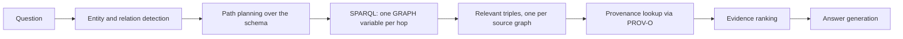

# Provenance-Aware Graph RAG with RDF

A small, self-contained demo of how **RDF Named Graphs** and **PROV-O** can preserve the origin of the knowledge used to answer a question, especially when sources contain **conflicting or outdated** information.

> **What this is (and is not):** the demo shows *traceability of external evidence*: which triples were retrieved, from which named graph, published by whom, and when. It does **not** explain the internal reasoning or "chain of thought" of a language model. If an LLM is used, it only turns already-retrieved evidence into prose.

**Stack:** Python 3.12 · RDFLib (in-memory `Dataset`, SPARQL 1.1) · Streamlit · optional Together AI. No external RDF database is needed.

---

## Why this exists

A plain RAG system retrieves text and hides where it came from. A plain triple store keeps facts but forgets which document asserted them, so two sources that disagree simply look like one property with two values.

This project keeps the source attached to every fact:

- each source document is stored in **its own named graph**,
- each graph is described with **PROV-O** (source URI, publisher, dates, source type),
- retrieval is a **SPARQL traversal that keeps the graph of every hop**,
- when sources disagree, **all** conflicting evidence is returned and the answer says so explicitly.

## The demo scenario

Five small documents, each loaded into its own named graph:

| Id | Source | Type | Published | Relevant content |
|----|--------|------|-----------|------------------|
| S1 | Official Acme AI page | OfficialWebsite | 2024-03-01 | HQ **Berlin**, CEO Bob Chen, 120 employees |
| S2 | Tech Herald article | NewsArticle | 2025-06-15 | Acme AI **moved to Munich**, 180 employees |
| S3 | ProNet profile of Alice Schmidt | EmployeeProfile | 2025-02-10 | Alice works at Acme AI as Senior Research Engineer |
| S4 | Legacy CRM export (CSV) | DatabaseDump | 2021-11-30 | HQ **Berlin**, CEO Carol Diaz, 95 employees |
| S5 | Open Gazetteer | ReferenceDataset | 2023-01-15 | Berlin and Munich are in Germany |

The interesting question is a multi-hop one:

```
Alice ── worksAt ──▶ Acme AI ── headquarters ──▶ ?City ── locatedIn ──▶ ?Country
```

with a deliberate conflict on the second hop (Berlin in S1 and S4, Munich in S2).

---

## Quick start

### Docker

```bash
docker compose up --build          # app on http://localhost:8501
docker compose --profile test run --rm tests
```

### Local

```bash
python3 -m venv .venv
.venv/bin/pip install -r requirements.txt

.venv/bin/streamlit run app.py     # web UI
.venv/bin/python -m pytest -q      # tests

# command line
.venv/bin/python -m provrag.cli "Where is the company Alice works for headquartered?"
.venv/bin/python -m provrag.cli --dump-trig       # print the whole RDF dataset
```

Everything runs without any API key. Answers then come from deterministic templates. See [Optional LLM layer](#optional-llm-layer) to enable LLM-written answers.

---

## How it works



1. **Entity and relation detection.** Aliases from a small registry (`data/entities.json`) and keyword patterns find the start entity and the relations the question asks for. (Optionally an LLM maps the question onto the same closed vocabulary; its output is validated.)
2. **Path planning.** Each predicate declares a domain and range (`worksAt: Person → Organization`, `headquarters: Organization → City`, ...). A breadth-first search over this schema finds the shortest predicate path that covers the requested relations. "Headquartered" from a `Person` gives `worksAt → headquarters`; "country" gives `worksAt → headquarters → locatedIn`. Inverse hops (`Who works at Acme AI?`) are supported.
3. **Graph traversal.** The plan becomes a SPARQL query with a separate `GRAPH ?gN` per hop:

   ```sparql
   SELECT ?n1 ?g1 ?n2 ?g2 WHERE {
     GRAPH ?g1 { res:AliceSchmidt ex:worksAt ?n1 . }
     GRAPH ?g2 { ?n1 ex:headquarters ?n2 . }
   }
   ```

   Every result row is a path in which each edge still knows its source graph. A path can mix sources, e.g. hop 1 from the profile (S3) and hop 2 from the news article (S2).
4. **Provenance lookup.** A second SPARQL query over the provenance graph resolves each `?g` to source URI, publisher, dates and source type.
5. **Evidence ranking.** See below. It only orders evidence.
6. **Answer generation.** A template or an LLM writes the answer from the evidence and the detected conflicts.

### The RDF model

One named graph per document, plus one graph that holds all provenance:

```trig
graph:acme-official-about             { res:AcmeAI ex:headquarters res:Berlin . }
graph:techherald-acme-moves-to-munich { res:AcmeAI ex:headquarters res:Munich . }
graph:legacy-crm-dump-2021            { res:AcmeAI ex:headquarters res:Berlin . }
```

PROV-O metadata for each graph (Turtle, abbreviated):

```turtle
graph:techherald-acme-moves-to-munich a prov:Entity ;
    ex:sourceId          "S2" ;
    prov:wasDerivedFrom  <https://techherald.example/2025/06/acme-ai-moves-to-munich> ;
    prov:wasAttributedTo <https://techherald.example/> ;
    prov:wasGeneratedBy  activity:extract-techherald-acme-moves-to-munich ;
    pav:retrievedOn      "2026-09-01"^^xsd:date .

<https://techherald.example/2025/06/acme-ai-moves-to-munich>
    a prov:Entity, ex:NewsArticle ;
    ex:sourceType     ex:NewsArticle ;
    dcterms:publisher <https://techherald.example/> ;
    dcterms:issued    "2025-06-15"^^xsd:date .

<https://techherald.example/> a prov:Agent, prov:Organization ; rdfs:label "Tech Herald" .

activity:extract-techherald-acme-moves-to-munich a prov:Activity ;
    prov:used <https://techherald.example/2025/06/acme-ai-moves-to-munich> ;
    prov:generated graph:techherald-acme-moves-to-munich .
```

### Conflict handling

Predicates marked *functional* (headquarters, CEO, employee count, job title, ...) that have more than one distinct value for the same subject are grouped into a **conflict**. Nothing is removed or merged:

- every competing value keeps all its evidence items (value, source, publisher, date),
- the answer must state that the sources disagree and list each value with its source,
- `worksAt` is *not* functional, so several employees of one company is not a conflict.

### Evidence ranking is prioritization, not truth

```
priority = ( w_fresh · 0.5^(age_days / half_life)  +  w_type · prior(source_type) ) / (w_fresh + w_type)
```

The score decides only the **order** in which evidence is shown and passed to the generator. A fresh news article can be wrong and an old official page can still be right, so a low score never removes evidence, and the score is never presented as a probability or confidence. Weights, half-life and reference date are adjustable in the UI sidebar.

---

## Example results

All of the following were produced with the LLM layer enabled (`deepseek-ai/DeepSeek-V4.1-Flash`). Without an API key the same evidence is returned with a template-written answer.

### 1. Multi-hop query with conflicting sources

**Question:** `Where is the company Alice works for headquartered?`

**Graph path:**
```
Alice Schmidt -worksAt [S3]-> Acme AI -headquarters [S1]-> Berlin
Alice Schmidt -worksAt [S4]-> Acme AI -headquarters [S4]-> Berlin
Alice Schmidt -worksAt [S3]-> Acme AI -headquarters [S2]-> Munich
(6 paths in total, each hop tagged with its source)
```

**Answer:**
> Alice Schmidt works for Acme AI [S3][S4]. The sources disagree on Acme AI's headquarters:
> - **Berlin**: Acme AI GmbH (OfficialWebsite), published 2024-03-01 [S1]; also Internal CRM (legacy system), published 2021-11-30 [S4].
> - **Munich**: Tech Herald (NewsArticle), published 2025-06-15 [S2].
>
> The most recently published statement is Munich [S2].

The system does not pick a winner. Two sources say Berlin, but they are the older ones; the newest says Munich. All three statements are returned with publisher and date.

### 2. Three hops, conflict that does not change the final answer

**Question:** `In which country is Alice's employer headquartered?`

**Graph path:**
```
Alice Schmidt -worksAt [S3]-> Acme AI -headquarters [S1]-> Berlin -locatedIn [S5]-> Germany
Alice Schmidt -worksAt [S3]-> Acme AI -headquarters [S2]-> Munich -locatedIn [S5]-> Germany
```

**Answer:**
> Alice Schmidt works at Acme AI [S3][S4], whose headquarters location is disputed: Berlin [S1][S4] vs. Munich [S2]. Both cities are located in **Germany** [S2][S5], so Alice's employer is headquartered in Germany regardless of which city is correct.

The question never mentions "headquarters"; the planner derived the third hop itself. The conflict is still reported, even though both branches end in Germany.

### 3. Old data versus new data

**Question:** `Who is the CEO of the company Alice works for?`

```
Alice Schmidt -worksAt [S3]-> Acme AI -ceo [S2]-> Bob Chen
Alice Schmidt -worksAt [S3]-> Acme AI -ceo [S1]-> Bob Chen
Alice Schmidt -worksAt [S3]-> Acme AI -ceo [S4]-> Carol Diaz
```

> The CEO is reported as Bob Chen by two sources [S1][S2] and as Carol Diaz by one [S4]. The most recently published statement is Bob Chen (2025-06-15) [S2]; the Carol Diaz claim comes from a legacy system dated 2021-11-30 [S4].

The outdated value is not deleted; it stays visible with its source and date.

### 4. No conflict (inverse traversal)

**Question:** `Who works at Acme AI?`

```
Acme AI -^worksAt [S3]-> Alice Schmidt
Acme AI -^worksAt [S4]-> Alice Schmidt, Bob Chen, Carol Diaz
```

> Alice Schmidt (ProNet [S3], Internal CRM [S4]), Bob Chen [S4], Carol Diaz [S4]. No conflicts were detected between the sources.

The system does not invent conflicts: several employees of one company is not a disagreement.

---

## Web UI

`streamlit run app.py` shows, for every question:

- the natural-language answer and which generator produced it,
- a conflict banner when sources disagree,
- **Graph path**: the planned traversal, a graph diagram (edges labelled with source ids, conflicting edges in red) and the concrete instance paths,
- **Evidence**: each triple with source, publisher, source type, publication and retrieval date, named graph, the original sentence or CSV row, and optional ranking columns,
- **SPARQL**: the generated retrieval query, its bindings, and the provenance query,
- **Raw RDF / provenance**: the retrieved triples as TriG inside their named graphs, the PROV-O Turtle for those graphs, and the prompt sent to the LLM (if used),
- **Pipeline trace**: each step with timings,
- **Sources & dataset**: the original documents, extracted facts, graph statistics, and a full TriG download.

## Optional LLM layer

The LLM layer is off unless a Together AI API key is provided to the process as the `TOGETHER_API_KEY` environment variable. Without it the application behaves identically except that answers come from templates.

When enabled:

- **Answer generation:** the prompt contains only the retrieved evidence lines (source id, publisher, type, date, priority) and the list of conflicts. The instructions are: answer only from the evidence, cite `[S#]` after each claim, never collapse conflicts, never treat priority as truth.
- **Conflict guard:** if the generated answer omits any conflicting value, the template disclosure is appended automatically and the UI says so.
- **Question parsing (off by default):** the LLM maps the question to the closed entity and relation vocabulary; output is validated and falls back to deterministic matching.
- Any API or network error falls back to the template answer.

## Project layout

```
.
├── app.py                  Streamlit UI
├── provrag/
│   ├── config.py           paths and optional settings
│   ├── vocab.py            namespaces and predicate schema (domain, range, functional)
│   ├── ingestion.py        source loading, entity registry, fact extraction
│   ├── rdf_builder.py      RDF Dataset construction, one named graph per source
│   ├── provenance.py       PROV-O attachment and SPARQL provenance lookup
│   ├── retrieval.py        parsing, path planning, SPARQL generation, conflicts
│   ├── ranking.py          freshness + source-type prioritization
│   ├── generation.py       template answers, LLM prompt, conflict guard
│   ├── llm.py              optional Together AI client
│   ├── pipeline.py         end-to-end orchestration
│   └── cli.py              command-line interface
├── data/
│   ├── entities.json       entity registry (labels, types, aliases)
│   └── sources/            manifest.json and the five source documents
├── tests/                  pytest suite
├── Dockerfile
├── docker-compose.yml
└── requirements.txt
```

## Tests

`pytest` runs 24 deterministic tests with no network access:

| File | Covers |
|------|--------|
| `test_named_graph_provenance.py` | one graph per source; facts stay in their own graph; complete PROV-O metadata; provenance kept separate from data |
| `test_multihop_retrieval.py` | path planning (2-hop, implicit 3-hop, inverse); entity detection; graph-per-hop SPARQL; paths mixing sources |
| `test_conflicts.py` | Berlin/Munich conflict preserved with the right sources; ranking reorders but never drops evidence; CEO and headcount conflicts; non-functional predicates are not conflicts |
| `test_source_metadata.py` | provenance lookup returns URI, publisher, type, and dates; every returned fact carries its source |
| `test_alice_question.py` | exact evidence for the Alice question; answer mentions the disagreement; guard restores omitted conflicts; LLM failure falls back to templates |

## Key concepts

- **RDF:** knowledge as `subject – predicate – object` triples with global identifiers, so facts from different documents about the same entity join automatically. That joining makes multi-hop traversal possible.
- **Named Graphs:** a set of triples with its own IRI; a triple plus its graph is a *quad*. The graph IRI is a handle that other statements, such as provenance, can refer to.
- **PROV-O:** the W3C provenance ontology (Entities, Activities, Agents). Here it describes where each named graph came from and who published it.
- **Graph RAG:** retrieval by traversing a knowledge graph instead of (only) matching text chunks; well suited to multi-hop questions where no single document contains the answer.
- **Evidence traceability:** the combination of the above. Each fact shown to the user or passed to the generator can be traced to a concrete source document, publisher, and date.

## Limitations

- Extraction uses hand-written patterns so the demo is reproducible. An LLM-based extractor could fill the same graphs, recorded as a different `prov:SoftwareAgent`.
- Provenance is per document (graph), not per statement. Statement-level provenance would need RDF-star or one graph per statement; the UI already shows the source sentence for each triple.
- The ranking priors are hand-set and illustrative.
- Entity linking uses a small closed registry, and the dataset is tiny by design.
